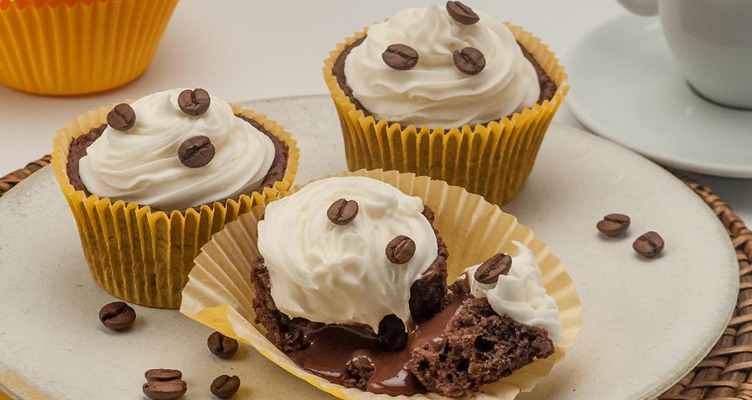

# 🧁 Página de Receita – Cupcake de Café com Chantilly

Bem-vindo(a) ao meu projeto de **HTML e CSS**! Essa é uma página simples, mas caprichada, mostrando uma receita deliciosa de cupcakes de café com chantilly 😋☕.

## 🖼️ Preview



---

## 📚 Sobre o Projeto

Este projeto foi criado com foco em:

- Praticar HTML e CSS puro.
- Aprender sobre organização de layout.
- Trabalhar com fontes externas e imagens de fundo.
- Construir uma página 100% responsiva para desktop.

> ✨ A ideia foi deixar tudo com um visual leve, bonito e elegante, combinando com o tema da receita!

---

## 🛠️ Tecnologias Utilizadas

- ✅ HTML5
- 🎨 CSS3
- 🌐 Google Fonts

---

## 📁 Estrutura de Pastas

```
📦 projeto-receita/ ┣ 📂 assets/ ┃ ┣ 📜 bg.jpg ┃ ┗ 📜 main-image.jpg ┃ ┗ 📜 heart.svg ┣ 📜 index.html ┗ 📜 style.css
```

---

## 💡 Funcionalidades

- Layout centralizado com container estilizado.
- Seções bem divididas: sobre a receita, ingredientes e modo de preparo.
- Responsividade mínima para desktop.
- Estilo vintage/clássico com fundo personalizado.

---

## 🚀 Como visualizar

1. Faça o clone deste repositório:
```bash
git clone https://github.com/seu-usuario/pagina-receita.git
```
2. Abra o arquivo index.html com seu navegador preferido.

## 📷 Inspiração Visual

Este projeto foi inspirado em páginas de receitas com estética retrô, pensadas para serem simples, aconchegantes e visualmente agradáveis 💛

---

## 👨‍🍳 Autor

Feito com muito carinho por **Renan Guilherme**  
📧 renanguilherme.profissional@outlook.com <br>
🔗 [LinkedIn - Renan Guilherme](https://www.linkedin.com/in/renan-guilherme)

---

## 🧠 Aprendizados

Durante esse projeto, aprendi mais sobre:

- Centralização com `margin: auto` e `box-sizing: border-box`.
- Importação de fontes do Google Fonts.
- Estruturação de HTML semântico.
- Uso de `section`, `ul`, `p`, `img` e `footer` da forma correta.

---

## ❤️ Agradecimentos

> Feito com ❤️ por alguém que ama codar e comer bem!
